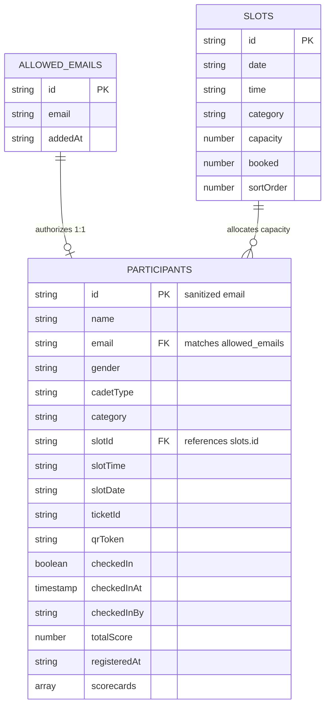

# 🗄️ SHAURYA-LAKSHYA V2 — Database Schema & Architecture

This document provides a comprehensive specification of the database architecture, schema definitions, validation rules, and security controls used in the **SHAURYA-LAKSHYA Event Manager V2** system.

---

## 🏗️ 1. Architecture Overview

- **Database Engine:** Google Cloud Firestore (NoSQL Document Store)
- **Client Library:** Firebase JS SDK v12+ (`modular / functional syntax`)
- **Offline / Edge Cache:** Web Storage API (`localStorage`) fallback mirrors for zero-latency UI updates.

### 🌐 Global Path Namespacing
All collections are namespaced within a partitioned document path to isolate environments and support multi-tenancy:

```
/databases/{database}/documents/artifacts/{appId}/public/data/{collectionName}/{documentId}
```

- **`{appId}`**: Defaults to the Firebase Project ID (e.g. `lakshya-2026`) or `import.meta.env.VITE_FIREBASE_APP_ID`.
- **Active Collections**:
  1. `participants`
  2. `slots`
  3. `allowed_emails`

---

## 📊 2. Entity Relationship & Flow



---

## 📑 3. Collection Specifications

### 3.1. `participants` Collection
Stores registered competitors, allocated time slots, digital ticket passes, gate check-in status, and live competition scorecards.

- **Firestore Path:** `/artifacts/{appId}/public/data/participants/{participantDocId}`
- **Primary Key (`participantDocId`):** Sanitized email string (`email.replace(/\//g, '__')`). This enforces a physical 1-booking-per-email constraint at the database level.

#### Field Schema

| Field Name | Type | Constraints / Format | Description |
| :--- | :--- | :--- | :--- |
| `id` | `string` | Matches document ID | Unique participant identifier |
| `name` | `string` | Length: `1` – `100` chars | Full candidate name |
| `email` | `string` | Length: `4` – `120` chars | Candidate email address (lowercase) |
| `gender` | `string` | `'Male'` \| `'Female'` \| `'General'` | Filter category for leaderboard ranking |
| `cadetType` | `string` | Default: `'General'` | Category classification |
| `category` | `string` | `'Air Rifle'` \| `'Air Pistol'` \| `'Pistol'` | Shooting discipline |
| `slotId` | `string` | References `slots.id` | Foreign key referencing chosen time slot |
| `slotTime` | `string` | e.g. `"08:00 - 09:00 HRS"` | Human-readable firing slot time |
| `slotDate` | `string` | e.g. `"26th September"` | Competition event day |
| `ticketId` | `string` | Pattern: `^TKT-[A-F0-9]{6}$` | 6-character hexadecimal pass code (e.g. `TKT-4D1E8F`) |
| `qrToken` | `string` | Cryptographic UUID / Token | Decoded by QR scanner for entrance admission |
| `checkedIn` | `boolean` | `true` \| `false` (default: `false`) | Range arrival verification flag |
| `checkedInAt` | `timestamp` \| `null`| Firestore `serverTimestamp()` | Timestamp of physical gate admission |
| `checkedInBy` | `string` \| `null` | Email address | Officer/admin account that stamped check-in |
| `totalScore` | `number` | Float / Int $\ge 0$ | Aggregated score (shots minus penalties) |
| `registeredAt`| `string` (ISO 8601)| UTC Timestamp | Exact time booking was committed |
| `scorecards` | `array<object>` | Array of scorecard objects | Round scores and shot records (supports re-entry) |

#### Scorecard Object Structure (`scorecards[]`)
```json
{
  "id": 1727337600000,
  "scores": ["10", "9.5", "10", "8", "9", "10", "9.2", "10", "9", "8.5"],
  "penalty": 0,
  "isDQ": false
}
```

---

### 3.2. `slots` Collection
Controls range firing points, daily schedules, hourly partitions, and real-time lane capacity.

- **Firestore Path:** `/artifacts/{appId}/public/data/slots/{slotId}`
- **Primary Key (`slotId`):** Standard generated ID (e.g. `std_slot_26th_September_Air_Rifle_0`) or custom timestamp ID.

#### Field Schema

| Field Name | Type | Defaults / Limits | Description |
| :--- | :--- | :--- | :--- |
| `id` | `string` | Alphanumeric slot ID | Unique slot key |
| `date` | `string` | e.g. `"26th September"`, `"27th September"` | Scheduled competition date |
| `time` | `string` | e.g. `"08:00 - 09:00 HRS"` | One-hour firing window |
| `category` | `string` | `'Air Rifle'` \| `'Air Pistol'` | Range discipline partition |
| `capacity` | `number` | **18** (Air Rifle) / **6** (Air Pistol) | Maximum firing lanes per hour |
| `booked` | `number` | `0 <= booked <= capacity` | Current count of confirmed shooters |
| `sortOrder` | `number` | Minutes from midnight (e.g. `480` for 08:00) | Numerical value used for chronologic ordering |

---

### 3.3. `allowed_emails` Collection
Access-control whitelist ensuring only verified students / cadets can book slots.

- **Firestore Path:** `/artifacts/{appId}/public/data/allowed_emails/{emailId}`
- **Primary Key (`emailId`):** Firestore auto-generated ID or `email_<timestamp>`.

#### Field Schema

| Field Name | Type | Description |
| :--- | :--- | :--- |
| `email` | `string` | Pre-approved email address (case-insensitive search) |
| `addedAt` | `string` (ISO 8601) | Timestamp when entry was added to the whitelist |

---

## 🔒 4. Security Rules & Access Controls

Security rules are formally defined in [`firestore.rules`](./firestore.rules):

### Admin Privileges
Admin access is restricted to verified email addresses defined in the security rule helper `isAdmin()`:
- `nccrvce2025@gmail.com`
- `nccrvceshaurya@gmail.com`
- `lokakshas.cs24@rvce.edu.in`
- `shaurya.lakshya.admin@gmail.com`
- `rvcecdtlokakshasridhar@gmail.com`

### Access Control Matrix

| Collection | Read Access | Create Access | Update Access | Delete Access |
| :--- | :--- | :--- | :--- | :--- |
| `allowed_emails` | Authenticated (Any) | Admin Only | Admin Only | Admin Only |
| `slots` | Authenticated (Any) | Admin Only | **Admin** OR **Public Booking** (increment `booked` by 1 within `capacity` only) | Admin Only |
| `participants` | Authenticated (Any) | **Admin** OR **Public Booking** (initial clean state: `checkedIn: false`, `totalScore: 0`) | Admin Only (tamper-proof scores & check-ins) | Admin Only |

---

## ⚡ 5. Atomic Booking & Concurrency Protection

To prevent race conditions, overbooking, and duplicate registrations, slot booking executes using Firestore's `runTransaction`:

```javascript
await runTransaction(db, async (transaction) => {
  // 1. Read current slot state atomically
  const slotDoc = await transaction.get(slotRef);
  if (!slotDoc.exists()) throw new Error("Slot no longer exists.");

  const slotData = slotDoc.data();
  if ((slotData.booked || 0) >= slotData.capacity) {
    throw new Error("SLOT FULL: Maximum capacity reached.");
  }

  // 2. Check if candidate has already registered
  const participantDoc = await transaction.get(participantRef);
  if (participantDoc.exists()) {
    throw new Error("You have already booked a slot with this email address.");
  }

  // 3. Atomically write participant & increment slot count
  transaction.set(participantRef, newParticipant);
  transaction.update(slotRef, { booked: (slotData.booked || 0) + 1 });
});
```

---

## 💾 6. Client-Side Offline Caching (`localStorage`)

To provide instantaneous rendering and resilience during intermittent range connectivity, data is mirrored locally:

| Storage Key | Associated Collection | Purpose |
| :--- | :--- | :--- |
| `lakshya_participants_v6` | `participants` | Real-time leaderboard and local participant list |
| `lakshya_slots_v6` | `slots` | Immediate slot grid availability rendering |
| `lakshya_emails_v6` | `allowed_emails` | Client-side pre-validation for email whitelist |
